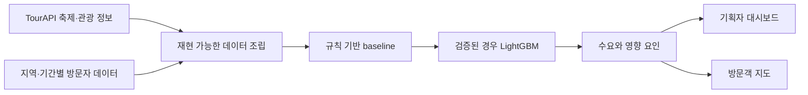

# 흥할지도 (HeungMap)

한국관광공사 TourAPI와 지역별 방문자 데이터를 결합해 축제 수요를 예측하고, 같은 결과를
기획자와 방문객의 의사결정에 연결하는 서비스 설계 저장소입니다.

현재 저장소에는 제품·데이터·기술 명세와 환경 변수 예시가 있습니다. 구현된 애플리케이션이나
학습된 모델은 아직 제공하지 않으며, 모델링에 앞서 축제와 방문자 데이터를 방어 가능한 방식으로
결합할 수 있는지 검증하는 단계입니다.

## 해결하려는 문제

축제 기획은 과거 경험과 정성 판단에 크게 의존하고, 방문자는 혼잡도와 주변 편의시설을 여러
서비스에서 따로 찾아야 합니다. 흥할지도는 하나의 예측 엔진으로 두 사용자의 흐름을 연결합니다.

| 사용자 | 입력 | 제공하려는 결과 |
| --- | --- | --- |
| 대형 행사·콘서트 기획자 | 지역, 시기, 기간, 규모, 테마 | 예상 수요, 영향 요인, 개최지·편의시설 보완점 |
| 소규모 독립 기획자·가수 | 제한된 예산에서 직접 준비하는 공연·행사의 시기, 장소와 규모 | 선택지별 수요 위험과 우선 보완점 |
| 축제·콘서트·행사 이용객 | 관심 행사와 방문 조건 | 예상 혼잡도, 티켓 수요 지표, 주차·숙박·연계 관광 정보 |

TourAPI의 축제·관광 정보를 서비스 탐색과 주변 정보의 기준 데이터로 사용하고, 지역·기간별 방문자
시계열을 결합해 수요 지표를 계산합니다.

공모전의 첫 데이터 검증과 구현 범위는 TourAPI로 설명 가능한 축제·지역 행사입니다. 콘서트와 홍대
클럽 같은 소규모 공연은 별도 수요 데이터가 확보된 뒤 같은 예측·의사결정 구조로 확장합니다.

## 데이터 검증 게이트

모델을 먼저 만들지 않고 다음 과정을 재현하는 것이 첫 번째 완료 조건입니다.

1. TourAPI `searchFestival2`에서 과거 축제의 이름·지역·기간·식별자를 수집합니다.
2. 같은 지역과 기간의 방문자 시계열을 별도 공공 API에서 가져옵니다.
3. 지역 코드와 기간을 기준으로 두 표를 결합합니다.
4. 학습에 사용할 수 있는 행 수, 결측률과 label의 의미를 기록합니다.
5. 근거가 부족하면 임의 보간으로 숨기지 않고 지역 단위 관광 혼잡 예측으로 범위를 전환합니다.

| 판정 | 다음 단계 |
| --- | --- |
| 축제별 label을 충분히 설명할 수 있음 | 축제 수요 예측 기능 구현 |
| 지역 단위 집계만 가능하거나 표본이 부족함 | 지역별 관광 혼잡 예측으로 전환 |

상세 수집·결합 절차는 [데이터와 API 문서](docs/DATA_AND_APIS.md)에 있습니다.

## 목표 제품 흐름



이 구성은 목표 아키텍처이며 구현 완료를 의미하지 않습니다. frontend, backend와 모델 선택은 데이터
게이트 결과에 따라 [기술 스택 문서](docs/TECH_STACK.md)의 기준으로 확정합니다.

## 전달 단계

| 단계 | 범위 | 완료 기준 |
| --- | --- | --- |
| 기반 흐름 | 데이터 조립, 규칙 기반 score, TourAPI, 입력·결과 화면과 지도 | 외부 모델 없이도 실행 가능한 사용자 흐름 |
| 예측 모델 | LightGBM 회귀와 baseline 비교 | held-out 또는 교차검증 지표와 재현 가능한 학습 절차 |
| 설명과 개선 | SHAP 영향 요인, 선택적 LLM 보완 report, UI 개선 | 계산 근거와 생성 문장을 구분하고 실패 fallback 제공 |

기반 흐름을 완성하기 전에는 후속 단계를 시작하지 않습니다. 범위를 줄일 때도 TourAPI를 사용하는
실행 가능한 제품 흐름과 검증 가능한 예측 근거는 유지합니다.

## 2인 역할 분담

두 팀원은 frontend와 backend 같은 기술 계층이 아니라 기획자 기능과 사용자 기능으로 나눠 각 흐름을
end-to-end로 책임집니다. 홍성주는 기획자 기능을, 박지성은 사용자 기능을 담당합니다. 사용자 기능 담당은
EVENT-US의 공개 행사 캘린더와 행사 지도를 조사해 정보구조와 상호작용 기준으로 삼습니다. 역할은
확정됐지만 조사 결과를 기록하기 전까지 실제 화면을 확인했다고 주장하지 않습니다.

역할을 정한 직후의 공동 작업, 첫 PR 순서와 파일 소유권은
[작업 시작 안내](docs/00_START_HERE.md)에 있습니다. 담당자별 책임과 협업 규칙은
[2인 역할 분담 문서](docs/TEAM_WORKFLOW.md)를 따릅니다.

## 데이터와 기술 후보

| 영역 | 현재 후보 | 확정 조건 |
| --- | --- | --- |
| 관광 데이터 | TourAPI `searchFestival2`, 위치 기반 관광 정보 | API 응답과 이용 조건 확인 |
| 예측 label | 지역·기간별 방문자 수 또는 평상시 대비 증가분 | 축제 단위 결합 가능성과 왜곡 검토 |
| 데이터·모델 | Python, pandas, LightGBM, SHAP | baseline보다 의미 있는 검증 결과 |
| API | FastAPI | model serving이 필요할 때 채택 |
| Web | Next.js 또는 Streamlit | 사용자 흐름, 유지보수 비용과 개발 속도로 결정 |
| Map | Kakao Map JavaScript SDK | 위치·주차·숙박 표현 검증 |

API key, 원본·가공 dataset, 학습 artifact와 개인 설정은 Git에 포함하지 않습니다. 재현 절차와 schema만
문서화하고 실제 데이터는 ignored `data/` 경로에서 다룹니다.

## 저장소 사용법

현재는 문서와 환경 변수 예시만 있으며 실행할 application command는 없습니다.

```bash
git clone https://github.com/ghdtjdwn/heungmap.git
cd heungmap
cp .env.example .env
```

`.env`에는 발급받은 key를 로컬에서만 저장합니다. 첫 실행 명령과 자동 검증은 데이터 수집 코드가
추가될 때 함께 정의합니다.

## 문서 지도

- [역할 결정 후 바로 시작하는 안내](docs/00_START_HERE.md)
- [서비스 범위](docs/SERVICE_SPEC.md)
- [2인 역할 분담과 작업 시작 절차](docs/TEAM_WORKFLOW.md)
- [기획자 입력·예측·LLM 추천 흐름과 담당 범위](docs/PLANNER_WORKFLOW.md)
- [사용자 캘린더·지도·상세 흐름과 담당 범위](docs/VISITOR_WORKFLOW.md)
- [전달 단계와 범위 조정 기준](docs/DELIVERY_MILESTONES.md)
- [데이터와 API, go/no-go 기준](docs/DATA_AND_APIS.md)
- [AI 모델 목표·입출력 후보·학습 및 검증 계획](docs/MODEL_PLAN.md)
- [1차·최종 심사기준과 자체 점검표](docs/EVALUATION_CRITERIA.md)
- [한국관광공사 OpenAPI와 외부 참고 API 카탈로그](docs/OPENAPI_CATALOG.md)
- [기술 스택 후보](docs/TECH_STACK.md)
- [결정 로그](docs/DECISION_LOG.md)

## 현재 제약

- 학습 데이터 결합, 예측 성능, frontend/backend 구현과 배포는 아직 검증되지 않았습니다.
- 절대 방문자 수와 평상시 대비 증가분 중 어떤 label이 더 방어 가능한지는 데이터 검증 후 결정합니다.
- 팀의 세부 구현 기여는 실제 작업이 시작된 뒤 기록합니다.
