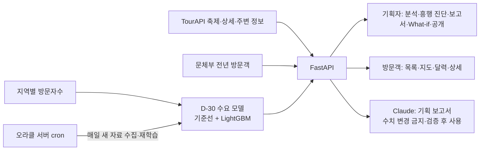

# 흥할지도 (HeungMap)

**한국관광공사 OpenAPI와 지역 방문자 빅데이터로 축제의 흥행 여건을 예측하고, 같은 예측을 기획자와 방문객 모두에게 연결하는
웹 서비스**입니다. 2026 관광데이터 활용 공모전 ②-2 웹·앱 구현 부문, 지정과제 9번(축제 흥행 예측) 출품작입니다.

- 팀: 경사하강단
- 모델 한눈에 보기: [모델 카드](docs/MODEL_CARD.md) · 시연 순서와 예상 질문: [3분 시연](docs/PLANNER_DEMO.md)

## 해결하는 문제

축제 기획은 과거 경험과 감에 크게 의존하고, 방문객은 일정·혼잡·주차·숙박을 여러 서비스에서 따로 찾아야 합니다.
흥할지도는 **하나의 예측 엔진**을 두 사용자에게 연결합니다.

| 사용자 | 하는 일 | 받는 것 |
| --- | --- | --- |
| 기획자(지자체·기획사·독립 기획자) | 행사명·일정(또는 후보)·시군구·규모·예산·제약을 단계별로 입력 | 행사기간 지역 방문수요 예측 범위, 흥행 진단, 우선 보완 항목, Claude가 쓴 기획 보고서, What-if 비교, 행사 공개 |
| 방문객 | TourAPI 축제를 목록·지도·달력으로 탐색 | 흥행 진단(평소 대비 방문수요·지난 회차 규모·같은 기간 축제), 예측 범위, 주변 관광지·주차·숙박 |

## 무엇을 예측하나 (정직한 정의)

행사 시작 **30일 전**에 알 수 있는 자료만으로, 행사기간 동안 그 **시군구 전체를 찾는 방문자-일**(날짜별 방문자 합)의
p10·p50·p90 범위를 예측합니다. 특정 축제의 관람객 수나 현장 혼잡도를 지어내지 않습니다. 축제 규모는 문화체육관광부에
주최 측이 보고한 **전년 방문객(실제값)**을 따로 보여 주고, 이 둘과 TourAPI 경쟁 축제 수·지역별 신뢰도를 묶어
**흥행 진단**으로 과제 9번 질문에 답합니다.

| 지표 (2026-08-01~19 시간 홀드아웃, 4,959 지역·일) | WAPE | 중앙 절대비율오차 | ±20% 이내 |
| --- | ---: | ---: | ---: |
| 계절·성장 기준선 | 4.256% | 3.514% | 97.24% |
| **채택 모델** (기준선 + LightGBM 잔차 보정) | **3.939%** | **3.344%** | 97.20% |

- 학습에 쓰지 않은 새 날짜(08-16~19)로 동결 모델을 채점한 **전향 평가**에서도 WAPE 4.43%(기준선 4.98%)였습니다.
- 작은 관광 군 지역은 오차가 커서 **신뢰도를 시군구별로** 표시합니다(홀드아웃 WAPE 5%/10% 기준).
- 사전에 정한 5개 채택 조건을 모두 통과한 모델만 서비스에 연결되고, 기여 요인은 LightGBM TreeSHAP으로 보여 줍니다.
- 시도한 뒤 기준 미달로 **채택하지 않은 것**도 기록했습니다: 축제별 관람객 모델(문체부 자료), TourAPI 축제 일정 입력(D30·D31).

## 한국관광공사 OpenAPI 활용

| TourAPI(KorService2) | 쓰는 곳 |
| --- | --- |
| `searchFestival2` | 방문객 축제 목록·지도·달력, 같은 기간·지역 경쟁 축제 수(흥행 진단), 데이터 게이트·모델 실험 |
| `detailCommon2`, `detailIntro2` | 방문객 축제 상세(소개·기간·홈페이지) |
| `searchKeyword2` | 기획자 장소 후보 검색 |
| `locationBasedList2` | 행사장·축제 주변 관광정보(관광지·문화시설·숙박·음식점 등). 주차장·숙박 보강은 Kakao Local |
| 지역별 방문자수(한국관광공사 데이터랩) | 예측 모델 학습·예측 입력(원본 47만 행, 264개 시군구) |

모든 결과에 출처·조회 시각을 붙여 화면의 "근거·출처"에서 추적할 수 있습니다. 보조 자료로 문화체육관광부 연도별 지역축제
정보(전년 방문객 실제값), Kakao Local·지도(주소·주차·숙박 보강)를 씁니다.

## 구조



- Web: Next.js App Router·TypeScript, 흥할지도 브랜드 로고·색상 토큰과 360px까지 반응형([UI 가이드](docs/UI_DESIGN_GUIDE.md))
- API: FastAPI·Pydantic(OpenAPI 3.1 공통 계약 `contracts/openapi.yaml`)
- 모델: pandas·LightGBM, 채택 artifact는 checksum·채택 조건을 검증한 뒤에만 불러옵니다.
- LLM: Claude(개발 `claude-sonnet-5`, 발표 `claude-fable-5-1`). 입력에 없는 숫자·근거·고정 제약 위반을 서버가 검사하고,
  통과하지 못하면 규칙 보고서로 전환합니다.
- 운영: 방문자 자료가 약 30일 늦게 공개되므로 오라클 서버가 매일 새 자료를 받아 재학습합니다([오라클 재학습](docs/ORACLE_MODEL_REFRESH.md)).

## 실행

Python 3.11 이상, Node.js 20.9 이상. 두 터미널에서 실행합니다.

Windows에서는 의존성과 로컬 모델이 준비된 뒤 저장소 루트에서 다음 한 명령으로 backend·frontend를
로컬 전용 주소에 실행하고 브라우저를 열 수 있습니다.

```powershell
.\scripts\start-local.ps1
# 종료할 때
.\scripts\stop-local.ps1
```

PowerShell 실행 정책이 로컬 스크립트를 막는 경우 현재 터미널에서만
`Set-ExecutionPolicy -Scope Process Bypass`를 실행한 뒤 다시 시작합니다. 로그는
`$env:TEMP\heungmap-local`에 저장되며 화면 주소는 `http://127.0.0.1:3000`입니다.

```bash
cp .env.example .env            # TOURAPI_SERVICE_KEY, VISITOR_API_SERVICE_KEY, KAKAO_*, LLM_* 입력
python3 -m venv .venv
brew install libomp             # macOS에서 LightGBM 실행에 필요
.venv/bin/pip install -r backend/requirements-dev.txt -r backend/requirements-model.txt
PYTHONPATH=backend .venv/bin/uvicorn app.main:app --reload --port 8000
```

```bash
cd frontend && npm install && npm run dev      # http://localhost:3000 → 로그인(체험 계정) → 역할 선택
```

기획자 화면의 **대형 축제 예시·소규모 행사 예시**는 날짜가 오늘 기준으로 계산돼 언제 열어도 실제 모델 예측이 나옵니다.
모델 자료 파일(`data/processed/daily-forecast-production-v*`)은 Git에 없으므로 [재현 절차](docs/MODEL_EVALUATION.md)로
만들거나 `scripts/oracle/pull.sh <서버>`로 가져옵니다.

## 검증

```bash
PYTHONPATH=backend .venv/bin/python -m pytest backend/tests -q          # 172 passed (외부 API 호출 없이 격리)
PYTHONPATH=backend .venv/bin/python backend/scripts/verify_daily_model.py  # 모델 상태·checksum·재계산·온라인 예측
PYTHONPATH=backend .venv/bin/python backend/scripts/evaluate_llm.py --output data/processed/llm-eval.json
cd frontend && npm run typecheck && npm run lint && npm run build && npm run e2e   # Playwright 24 passed
```

실행 중 모델 상태는 `GET /api/v1/system/model-status`와 기획자 대시보드의 "수요 모델" 카드에서 확인합니다.

## 한계 (숨기지 않는 것)

- 예측값은 시군구 전체 방문자-일이며 특정 축제 관람객·현장 혼잡·티켓 수요·축제의 인과효과가 아닙니다.
- 방문자 이력이 약 1년 반이라 명절 이동·기상이변을 충분히 학습하지 못했습니다. 성능은 후향 홀드아웃과 4일 전향 평가 기준입니다.
- 예측은 오늘부터 30일 이내에 시작하거나 진행 중인 행사의 남은 날짜(최대 30일)를 대상으로 하며, 2026년 7월 행정구역 개편으로
  새로 생긴 인천 영종구·제물포구 등은 1년 이력이 쌓일 때까지 예측하지 않습니다.
- 로그인은 체험용 모의 로그인이고 기획 초안은 브라우저에 저장됩니다. 실제 Google 연결·웹 서비스 운영 배포는 이번 범위 밖입니다.

## 문서

| 주제 | 문서 |
| --- | --- |
| 모델 요약·성능·한계 | [MODEL_CARD.md](docs/MODEL_CARD.md), [MODEL_EVALUATION.md](docs/MODEL_EVALUATION.md) |
| 시연 순서·예상 질문 | [PLANNER_DEMO.md](docs/PLANNER_DEMO.md) |
| 서비스 범위·공통 계약 | [SERVICE_SPEC.md](docs/SERVICE_SPEC.md), [SHARED_SPEC.md](docs/SHARED_SPEC.md), [contracts/openapi.yaml](contracts/openapi.yaml) |
| 데이터·API·게이트 | [DATA_AND_APIS.md](docs/DATA_AND_APIS.md), [OPENAPI_CATALOG.md](docs/OPENAPI_CATALOG.md), [DATA_GATE_REPORT.md](docs/DATA_GATE_REPORT.md), [data/README.md](data/README.md) |
| 기획자·방문객 흐름 | [PLANNER_WORKFLOW.md](docs/PLANNER_WORKFLOW.md), [VISITOR_WORKFLOW.md](docs/VISITOR_WORKFLOW.md), [SERVICE_INTEGRATION.md](docs/SERVICE_INTEGRATION.md) |
| 재학습 운영 | [ORACLE_MODEL_REFRESH.md](docs/ORACLE_MODEL_REFRESH.md) |
| 심사기준 대응 | [EVALUATION_CRITERIA.md](docs/EVALUATION_CRITERIA.md) |
| 모든 결정의 이유 | [DECISION_LOG.md](docs/DECISION_LOG.md) (D1~D38) |
| UI 브랜드·반응형·접근성 기준 | [UI_DESIGN_GUIDE.md](docs/UI_DESIGN_GUIDE.md) |
| 개발 시작 안내 | [00_START_HERE.md](docs/00_START_HERE.md) |
