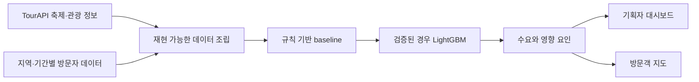

# 흥할지도 (HeungMap)

한국관광공사 TourAPI와 지역별 방문자 데이터를 결합해 축제 수요를 예측하고, 같은 결과를
기획자와 방문객의 의사결정에 연결하려는 2인 팀 프로젝트입니다.

> 현재 단계: 2026 관광데이터 활용 공모전 참가 신청 완료 · 구현 전 데이터 적합성 검증 대기

이 저장소는 아직 구현된 서비스나 학습된 모델을 제공하지 않습니다. 가장 큰 위험인 “축제와 방문자
라벨을 방어 가능한 방식으로 결합할 수 있는가”를 먼저 확인한 뒤 기술 스택과 예측 범위를 확정합니다.

## 해결하려는 문제

축제 기획은 과거 경험과 정성 판단에 크게 의존하고, 실제 방문자는 혼잡도와 주변 편의시설을 여러
서비스에서 따로 찾아야 합니다. 흥할지도는 하나의 예측 엔진으로 두 사용자의 흐름을 연결합니다.

| 사용자 | 입력 | 제공하려는 결과 |
| --- | --- | --- |
| 기획자 | 지역, 시기, 기간, 규모, 테마 | 예상 수요, 영향 요인, 개최지·편의시설 보완점 |
| 방문객 | 관심 축제와 방문 조건 | 예상 혼잡도, 티켓 수요 지표, 주차·숙박·연계 관광 정보 |

한국관광공사 OpenAPI 활용이 필수인 지정과제 9번을 대상으로 하며, 실제 축제 탐색과 주변 관광 정보에
TourAPI를 제품의 핵심 데이터로 사용합니다.

## 먼저 통과해야 하는 데이터 게이트

모델을 먼저 만들지 않고 다음 검증을 며칠 안에 재현하는 것이 첫 번째 완료 조건입니다.

1. TourAPI `searchFestival`에서 과거 축제의 이름·지역·기간·식별자를 수집합니다.
2. 같은 지역과 기간의 방문자 시계열을 별도 공공 API에서 가져옵니다.
3. 지역 코드와 기간을 기준으로 두 표를 결합합니다.
4. 학습에 사용할 수 있는 행 수, 결측률과 label의 의미를 기록합니다.
5. 근거가 부족하면 임의 보간으로 숨기지 않고 관광 혼잡 예측 과제로 전환합니다.

| 판정 | 다음 단계 |
| --- | --- |
| 축제별 label을 충분히 설명할 수 있음 | 지정과제 9번과 Tier 0 진행 |
| 지역 단위 집계만 가능하거나 표본이 부족함 | 지정과제 2번 관광 혼잡 예측으로 pivot |

상세 수집·결합 절차는 [데이터 스파이크 문서](docs/04_DATA_AND_APIS.md)에 있습니다.

## 계획한 제품 흐름



이 구성은 목표 아키텍처이며 현재 구현 완료를 의미하지 않습니다. frontend, backend와 모델 선택은
데이터 게이트를 통과한 뒤 [기술 스택 결정 문서](docs/05_TECH_STACK.md)에서 확정합니다.

## 단계별 전달 전략

| 단계 | 범위 | 완료 기준 |
| --- | --- | --- |
| Tier 0 | 데이터 조립, 규칙 기반 score, TourAPI, 입력·결과 화면과 지도 | ML이 없어도 제출 가능한 전체 흐름 |
| Tier 1 | LightGBM 회귀와 baseline 비교 | held-out 또는 교차검증 지표와 재현 가능한 학습 절차 |
| Tier 2 | SHAP 영향 요인, LLM 보완 report, UI 개선 | 근거와 생성 문장을 분리하고 실패 fallback 제공 |

Tier 0를 완성하기 전에는 다음 단계를 시작하지 않습니다. 시간이 부족하면 LLM, SHAP, ML 순으로
범위를 줄이되 TourAPI를 사용하는 동작 가능한 제품 흐름은 유지합니다.

## 데이터와 기술 후보

| 영역 | 현재 후보 | 확정 조건 |
| --- | --- | --- |
| 필수 관광 데이터 | TourAPI `searchFestival`, 위치 기반 관광 정보 | API 응답과 이용 조건 확인 |
| 예측 label | 지역·기간별 방문자 수 또는 평상시 대비 증가분 | 축제 단위 결합 가능성과 왜곡 검토 |
| 데이터·모델 | Python, pandas, LightGBM, SHAP | baseline보다 의미 있는 검증 결과 |
| API | FastAPI | model serving이 필요할 때 채택 |
| Web | Next.js 또는 Streamlit | 팀의 학습 비용과 Tier 0 일정으로 결정 |
| Map | Kakao Map JavaScript SDK | 위치·주차·숙박 표현 검증 |

API key, 원본·가공 dataset, 학습 artifact와 개인 설정은 Git에 포함하지 않습니다. 재현 절차와 schema만
문서화하고 실제 데이터는 ignored `data/` 경로에서 다룹니다.

## 저장소 사용법

현재는 문서와 환경 변수 예시만 있으며 실행할 application command는 없습니다.

```bash
git clone https://github.com/ghdtjdwn/heungmap.git
cd heungmap
cp .env.example .env
```

`.env`에는 발급받은 key를 로컬에서만 저장합니다. 첫 실행 명령과 자동 검증은 데이터 스파이크 코드가
추가될 때 함께 정의합니다.

## 문서 지도

- [현재 상태와 다음 작업](docs/00_START_HERE.md)
- [공모전 조건](docs/01_COMPETITION.md)
- [서비스 범위](docs/02_SERVICE_SPEC.md)
- [Tier 로드맵](docs/03_ROADMAP_TIERS.md)
- [데이터와 API, go/no-go 기준](docs/04_DATA_AND_APIS.md)
- [기술 스택 후보](docs/05_TECH_STACK.md)
- [결정 로그](docs/07_DECISION_LOG.md)

## 현재 제약

- 학습 데이터 결합, 예측 성능, frontend/backend 구현과 배포는 아직 검증되지 않았습니다.
- 절대 방문자 수와 평상시 대비 증가분 중 어떤 label이 더 방어 가능한지는 데이터 스파이크 후 결정합니다.
- 팀 역할은 공동 기획까지만 확정됐으며 세부 구현 기여는 작업이 시작된 뒤 기록합니다.
